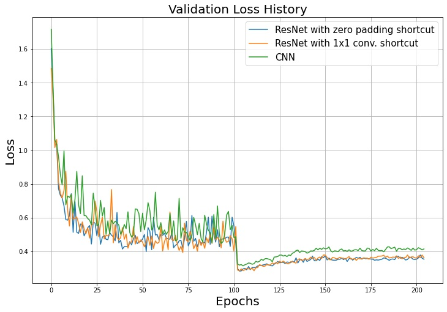
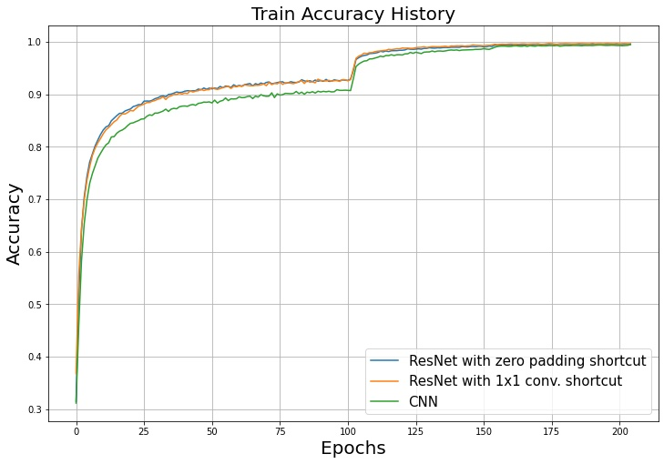
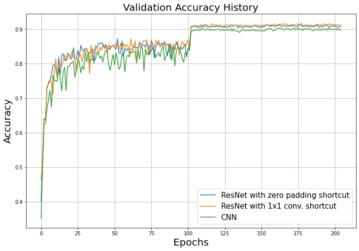

# Residual Network (ResNet) Image Classification
한국어 버전의 설명은 [여기](./docs/README_ko.md)를 참고하시기 바랍니다.

## Introduction
Residual Network (ResNet) was the first model to achieve better results than humans when it was initially introduced.
The idea behind ResNet was simple, yet its performance was remarkable.
By connecting shortcuts between CNN layers, it resolved the issue of gradient vanishing, which was a significant problem in deep CNN models.
This code trains a model based on ResNet to predict CIFAR-10 labels. For more information on ResNet, please refer to [Residual Network (ResNet)](https://ljm565.github.io/contents/CNN3.html).
<br><br><br>

## Supported Models
### CNN
* A CNN using `nn.Conv2d` is implemented.
### Customized ResNet
* The vanilla ResNet was designed to classify ImageNet. 
However, here we implement a customized ResNet tailored to the size of the CIFAR-10 dataset.
<br><br><br>

## Base Dataset
* Base dataset for tutorial is [CIFAR-10](https://www.cs.toronto.edu/~kriz/cifar.html).
* Custom datasets can also be used by setting the path in the `config/config.yaml`.
However, implementing a custom dataloader may require additional coding work in `src/utils/data_utils.py`.
<br><br><br>

## Supported Devices
* CPU, GPU, multi-GPU (DDP), MPS (for Mac and torch>=1.12.0)
<br><br><br>

## Quick Start
```bash
python3 src/run/train.py --config config/config.yaml --mode train
```
<br><br>

## Project Tree
This repository is structured as follows.
```
├── configs                     <- Folder for storing config files
│   └── *.yaml
│
└── src      
    ├── models
    |   ├── nn.py               <- Modules for ResNet   
    |   └── resnet.py           <- ResNet model file
    |
    ├── run                   
    |   ├── cal_acc.py          <- Calculating accuracy of the trained model
    |   ├── train.py            <- Training execution file
    |   └── validation.py       <- Trained model evaulation execution file
    | 
    ├── tools                   
    |   ├── model_manager.py          
    |   └── training_logger.py  <- Training logger class file
    |
    ├── trainer                 
    |   ├── build.py            <- Codes for initializing dataset, dataloader, etc.
    |   └── trainer.py          <- Class for training, evaluating, and calculating accuracy
    |
    └── uitls                   
        ├── __init__.py         <- File for initializing the logger, versioning, etc.
        ├── data_utils.py       <- File defining the custom dataset dataloader
        ├── filesys_utils.py       
        └── training_utils.py     
```
<br><br>

## Tutorials & Documentations
Please follow the steps below to train a ResNet image classification model.
1. [Getting Started](./docs/1_getting_started.md)
2. [Data Preparation](./docs/2_data_preparation.md)
3. [Training](./docs/3_trainig.md)
4. ETC
   * [Evaluation](./docs/4_model_evaluation.md)
   * [Accuracy Calculation](./docs/5_acc_cal.md)

<br><br><br>

## Training Results
* Training set loss history
<br><br>

* Validation set loss history
<br><br>

* Training set accuracy history
<br><br>

* Validation set accuracy history
<br><br>

* Test set accuracy<br>
ResNet with zero padding shortcut: 0.899000<br>
ResNet with 1x1 conv. shortcut   : 0.902700<br>
CNN                              : 0.898200<br><br>
<br><br><br>