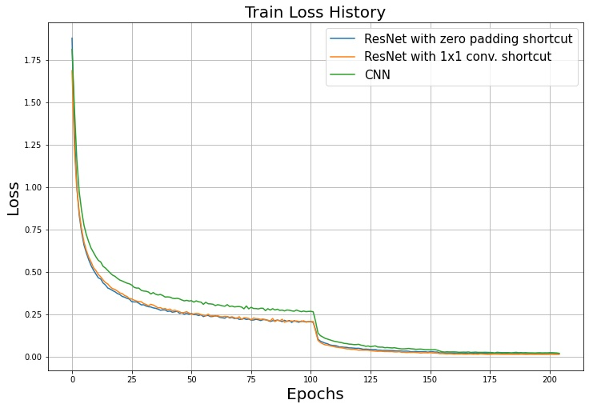
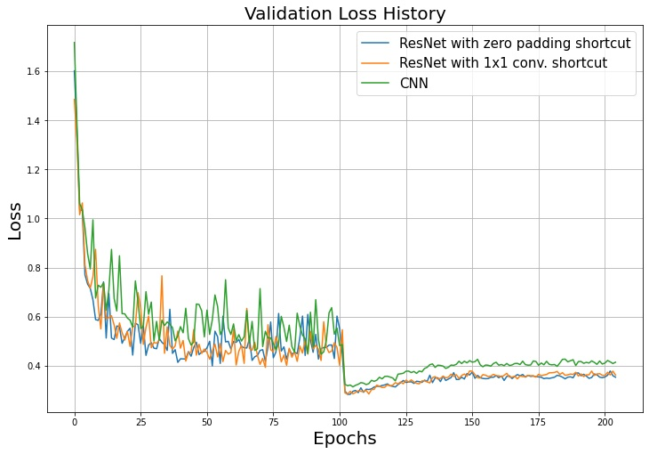

# Residual Network (ResNet) Image Classification

## Introduction
Residual Network (ResNet)은 처음 등장 당시 사람보다 더 좋은 결과를 낸 최초의 모델이었습니다.
ResNet의 아이디어는 단순했지만 그 성능은 대단했습니다. CNN 레이어 사이에 shortcut을 연결하여 기존 깊은 CNN 모델의 문제점이었던 gradient vanishing 현상을 해결하였습니다.
본 코드는 ResNet을 기반으로 CIFAR-10 label을 예측하는 모델을 학습합니다.
ResNet에 대한 설명은 [Residual Network (ResNet)](https://ljm565.github.io/contents/CNN3.html)를 참고하시기 바랍니다.
<br><br><br>

## Supported Models
### CNN
* `nn.Conv2d`를 사용한 CNN이 구현되어 있습니다.

### Customized ResNet
* Vanilla ResNet은 ImageNet을 분류하기 위해 제작되었습니다.
하지만 여기서는 CIFAR-10 데이터 크기에 맞춘 cutomized ResNet을 구현합니다.
<br><br><br>

## 사용 데이터
* 실험으로 사용하는 데이터는 [CIFAR-10](https://www.cs.toronto.edu/~kriz/cifar.html) 데이터입니다.
* `config/config.yaml`에 학습 데이터의 경로를 설정하여 사용자가 가지고 있는 custom 데이터도 학습 가능합니다.
다만 `src/utils/data_utils.py`에 custom dataloader 코드를 구현해야할 수도 있습니다.
<br><br><br>

## Supported Devices
* CPU, GPU, multi-GPU (DDP), MPS (for Mac and torch>=1.12.0)
<br><br><br>

## Quick Start
```bash
python3 src/run/train.py --config config/config.yaml --mode train
```
<br><br>

## Project Tree
본 레포지토리는 아래와 같은 구조로 구성됩니다.
```
├── configs                         <- Config 파일들을 저장하는 폴더
│   └── *.yaml
│
└── src      
    ├── models
    |   ├── nn.py                   <- ResNet 모델 모듈
    |   └── resnet.py               <- ResNet 모델 파일
    |
    ├── run                   
    |   ├── cal_acc.py              <- Accuracy 계산 실행 파일
    |   ├── train.py                <- 학습 실행 파일
    |   └── validation.py           <- 학습된 모델 평가 실행 파일
    | 
    ├── tools    
    |   ├── model_manager.py          
    |   └── training_logger.py      <- Training logger class 파일
    |
    ├── trainer                 
    |   ├── build.py                <- Dataset, dataloader 등을 정의하는 파일
    |   └── trainer.py              <- 학습, 평가, accuracy 계산 class 파일
    |
    └── uitls                   
        ├── __init__.py             <- Logger, 버전 등을 초기화 하는 파일
        ├── data_utils.py           <- Custom dataloader 파일
        ├── filesys_utils.py       
        └── training_utils.py     
```
<br><br>


## Tutorials & Documentations
ResNet 이미지 분류 모델 학습을 위해서 다음 과정을 따라주시기 바랍니다.
1. [Getting Started](./1_getting_started_ko.md)
2. [Data Preparation](./2_data_preparation_ko.md)
3. [Training](./3_trainig_ko.md)
4. ETC
   * [Evaluation](./4_model_evaluation_ko.md)
   * [Accuracy Calculation](./5_acc_cal_ko.md)
<br><br><br>

## Training Results
* Training set loss history
<br><br>

* Validation set loss history
<br><br>

* Training set accuracy history
<br><br>

* Validation set accuracy history
<br><br>

* Test set accuracy<br>
ResNet with zero padding shortcut: 0.899000<br>
ResNet with 1x1 conv. shortcut   : 0.902700<br>
CNN                              : 0.898200<br><br>
<br><br><br>